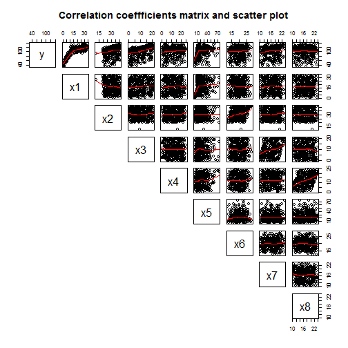
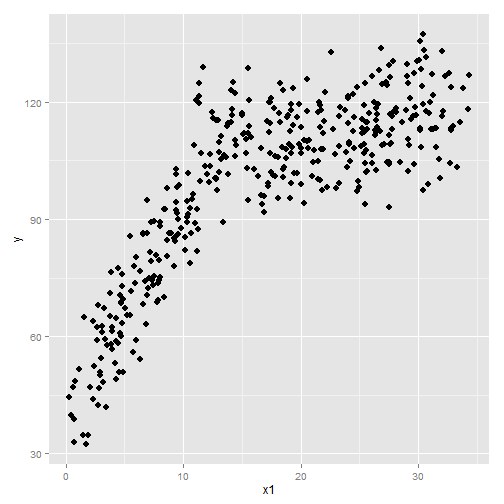

# MSIA 400 - Assignment 2
## *Steven Lin*


## Setup


```r

# Setup ####

# My PC
main = "C:/Users/Steven/Documents/Academics/3_Graduate School/2014-2015 ~ NU/"

# Aginity main = '\\\\nas1/labuser169'

course = "MSIA_400_Analytics for Competitive Advantage"
datafolder = "Lab/Assignment_02"
setwd(file.path(main, course, datafolder))
```


## Problem 1


```r
# Import data
filename = "bostonhousing.txt"
mydata = read.table(filename, header = T)

# Look at data
names(mydata)
head(mydata)
nrow(mydata)
summary(mydata)
```


### Part a


```r
reg = lm(MEDV ~ ., mydata)
summary(reg)
```

```
## 
## Call:
## lm(formula = MEDV ~ ., data = mydata)
## 
## Residuals:
##     Min      1Q  Median      3Q     Max 
## -15.594  -2.730  -0.518   1.777  26.199 
## 
## Coefficients:
##              Estimate Std. Error t value Pr(>|t|)    
## (Intercept)  3.65e+01   5.10e+00    7.14  3.3e-12 ***
## CRIM        -1.08e-01   3.29e-02   -3.29  0.00109 ** 
## ZN           4.64e-02   1.37e-02    3.38  0.00078 ***
## INDUS        2.06e-02   6.15e-02    0.33  0.73829    
## CHAS         2.69e+00   8.62e-01    3.12  0.00193 ** 
## NOX         -1.78e+01   3.82e+00   -4.65  4.2e-06 ***
## RM           3.81e+00   4.18e-01    9.12  < 2e-16 ***
## AGE          6.92e-04   1.32e-02    0.05  0.95823    
## DIS         -1.48e+00   1.99e-01   -7.40  6.0e-13 ***
## RAD          3.06e-01   6.63e-02    4.61  5.1e-06 ***
## TAX         -1.23e-02   3.76e-03   -3.28  0.00111 ** 
## PTRATIO     -9.53e-01   1.31e-01   -7.28  1.3e-12 ***
## B            9.31e-03   2.69e-03    3.47  0.00057 ***
## LSTAT       -5.25e-01   5.07e-02  -10.35  < 2e-16 ***
## ---
## Signif. codes:  0 '***' 0.001 '**' 0.01 '*' 0.05 '.' 0.1 ' ' 1 
## 
## Residual standard error: 4.75 on 492 degrees of freedom
## Multiple R-squared: 0.741,	Adjusted R-squared: 0.734 
## F-statistic:  108 on 13 and 492 DF,  p-value: <2e-16
```


*INDUS* and *AGE* are least likely to be in the model because their p-values are 0.738 and 0.958 respectively, indicating they **are not significant** in predicting MEDV given the other varibles are in the model (coefficients not significantly different than zero)

### Part b


```r
reg.picked = update(reg, . ~ . - INDUS - AGE)
summary(reg.picked)
```

```
## 
## Call:
## lm(formula = MEDV ~ CRIM + ZN + CHAS + NOX + RM + DIS + RAD + 
##     TAX + PTRATIO + B + LSTAT, data = mydata)
## 
## Residuals:
##     Min      1Q  Median      3Q     Max 
## -15.598  -2.739  -0.505   1.727  26.237 
## 
## Coefficients:
##              Estimate Std. Error t value Pr(>|t|)    
## (Intercept)  36.34115    5.06749    7.17  2.7e-12 ***
## CRIM         -0.10841    0.03278   -3.31  0.00101 ** 
## ZN            0.04584    0.01352    3.39  0.00075 ***
## CHAS          2.71872    0.85424    3.18  0.00155 ** 
## NOX         -17.37602    3.53524   -4.92  1.2e-06 ***
## RM            3.80158    0.40632    9.36  < 2e-16 ***
## DIS          -1.49271    0.18573   -8.04  6.8e-15 ***
## RAD           0.29961    0.06340    4.73  3.0e-06 ***
## TAX          -0.01178    0.00337   -3.49  0.00052 ***
## PTRATIO      -0.94652    0.12907   -7.33  9.2e-13 ***
## B             0.00929    0.00267    3.47  0.00056 ***
## LSTAT        -0.52255    0.04742  -11.02  < 2e-16 ***
## ---
## Signif. codes:  0 '***' 0.001 '**' 0.01 '*' 0.05 '.' 0.1 ' ' 1 
## 
## Residual standard error: 4.74 on 494 degrees of freedom
## Multiple R-squared: 0.741,	Adjusted R-squared: 0.735 
## F-statistic:  128 on 11 and 494 DF,  p-value: <2e-16
```

### Part c


```r
# Is the formulate right? Should it be dividing by number of obs?

# Functions to calculate
compute_MSE = function(fit) {
    return(round(sum((fit$res)^2)/fit$df.res, 3))
}

compute_MAE = function(fit) {
    return(round(sum(abs(reg$res))/fit$df.res, 3))
}

# List of models
models = list(reg = reg, reg.picked = reg.picked)

results = rbind(sapply(models, compute_MSE), sapply(models, compute_MAE))
rownames(results) = c("MSE", "MAE")
results
```

```
##        reg reg.picked
## MSE 22.518      22.43
## MAE  3.364       3.35
```


The model with the lowest MSE and MAE is preferred, so in this case pick reg.picked

### Part d

```r
# step(reg)
summary(step(reg))
```

```
## Start:  AIC=1590
## MEDV ~ CRIM + ZN + INDUS + CHAS + NOX + RM + AGE + DIS + RAD + 
##     TAX + PTRATIO + B + LSTAT
## 
##           Df Sum of Sq   RSS  AIC
## - AGE      1         0 11079 1588
## - INDUS    1         3 11081 1588
## <none>                 11079 1590
## - CHAS     1       219 11298 1598
## - TAX      1       242 11321 1599
## - CRIM     1       243 11322 1599
## - ZN       1       257 11336 1599
## - B        1       271 11349 1600
## - RAD      1       479 11558 1609
## - NOX      1       487 11566 1609
## - PTRATIO  1      1194 12273 1639
## - DIS      1      1232 12311 1641
## - RM       1      1871 12950 1667
## - LSTAT    1      2411 13490 1687
## 
## Step:  AIC=1588
## MEDV ~ CRIM + ZN + INDUS + CHAS + NOX + RM + DIS + RAD + TAX + 
##     PTRATIO + B + LSTAT
## 
##           Df Sum of Sq   RSS  AIC
## - INDUS    1         3 11081 1586
## <none>                 11079 1588
## - CHAS     1       220 11299 1596
## - TAX      1       242 11321 1597
## - CRIM     1       243 11322 1597
## - ZN       1       260 11339 1597
## - B        1       272 11351 1598
## - RAD      1       481 11560 1607
## - NOX      1       521 11600 1609
## - PTRATIO  1      1200 12279 1638
## - DIS      1      1352 12431 1644
## - RM       1      1960 13038 1668
## - LSTAT    1      2719 13798 1697
## 
## Step:  AIC=1586
## MEDV ~ CRIM + ZN + CHAS + NOX + RM + DIS + RAD + TAX + PTRATIO + 
##     B + LSTAT
## 
##           Df Sum of Sq   RSS  AIC
## <none>                 11081 1586
## - CHAS     1       227 11309 1594
## - CRIM     1       245 11327 1595
## - ZN       1       258 11339 1595
## - B        1       271 11352 1596
## - TAX      1       274 11355 1596
## - RAD      1       501 11582 1606
## - NOX      1       542 11623 1608
## - PTRATIO  1      1206 12288 1636
## - DIS      1      1449 12530 1646
## - RM       1      1964 13045 1666
## - LSTAT    1      2723 13805 1695
```

```
## 
## Call:
## lm(formula = MEDV ~ CRIM + ZN + CHAS + NOX + RM + DIS + RAD + 
##     TAX + PTRATIO + B + LSTAT, data = mydata)
## 
## Residuals:
##     Min      1Q  Median      3Q     Max 
## -15.598  -2.739  -0.505   1.727  26.237 
## 
## Coefficients:
##              Estimate Std. Error t value Pr(>|t|)    
## (Intercept)  36.34115    5.06749    7.17  2.7e-12 ***
## CRIM         -0.10841    0.03278   -3.31  0.00101 ** 
## ZN            0.04584    0.01352    3.39  0.00075 ***
## CHAS          2.71872    0.85424    3.18  0.00155 ** 
## NOX         -17.37602    3.53524   -4.92  1.2e-06 ***
## RM            3.80158    0.40632    9.36  < 2e-16 ***
## DIS          -1.49271    0.18573   -8.04  6.8e-15 ***
## RAD           0.29961    0.06340    4.73  3.0e-06 ***
## TAX          -0.01178    0.00337   -3.49  0.00052 ***
## PTRATIO      -0.94652    0.12907   -7.33  9.2e-13 ***
## B             0.00929    0.00267    3.47  0.00056 ***
## LSTAT        -0.52255    0.04742  -11.02  < 2e-16 ***
## ---
## Signif. codes:  0 '***' 0.001 '**' 0.01 '*' 0.05 '.' 0.1 ' ' 1 
## 
## Residual standard error: 4.74 on 494 degrees of freedom
## Multiple R-squared: 0.741,	Adjusted R-squared: 0.735 
## F-statistic:  128 on 11 and 494 DF,  p-value: <2e-16
```


The model from step(reg) is the same model as reg.picked from 1 b).

## Problem 2


```r
# Import data
filename = "labdata.txt"
mydata = read.table(filename, header = T)

# Look at data
names(mydata)
head(mydata)
nrow(mydata)
summary(mydata)
```


### Part a

```r
reg = lm(y ~ ., mydata)
summary(reg)
```

```
## 
## Call:
## lm(formula = y ~ ., data = mydata)
## 
## Residuals:
##     Min      1Q  Median      3Q     Max 
## -25.714  -7.313  -0.172   7.428  23.891 
## 
## Coefficients:
##             Estimate Std. Error t value Pr(>|t|)    
## (Intercept)  17.5857     5.1022    3.45  0.00063 ***
## x1            1.9194     0.0549   34.95  < 2e-16 ***
## x2            0.8975     0.0839   10.70  < 2e-16 ***
## x3            1.0790     0.0837   12.89  < 2e-16 ***
## x4            0.2383     0.0876    2.72  0.00680 ** 
## x5            0.1014     0.0372    2.72  0.00677 ** 
## x6            0.2961     0.1515    1.95  0.05142 .  
## x7           -0.0627     0.1582   -0.40  0.69226    
## x8           -0.0152     0.1585   -0.10  0.92386    
## ---
## Signif. codes:  0 '***' 0.001 '**' 0.01 '*' 0.05 '.' 0.1 ' ' 1 
## 
## Residual standard error: 10 on 391 degrees of freedom
## Multiple R-squared: 0.811,	Adjusted R-squared: 0.807 
## F-statistic:  210 on 8 and 391 DF,  p-value: <2e-16
```


### Part b


```r
# plot y vs x
pairs(mydata, main = "Correlation coeffficients matrix and scatter plot", pch = 21, 
    lower.panel = NULL, panel = panel.smooth, cex.labels = 2)

# Select x1

# Load packages
library(ggplot2)
```

 

```r

ggplot(mydata, aes(x = x1, y = y)) + geom_point(size = 3)
```

 


X1 is the variable that is most likely to be used in a piecewise regression model.

### Part c


```r
mean_x1 = mean(mydata$x1)
mean_x1

reg.piece = lm(y ~ (x1 < mean_x1) * x1 + x2 + x3 + x4 + x5 + x6 + x7 + x8, mydata)
summary(reg.piece)

# reg.piece = lm(y~ . + (x1<mean_x1)*x1 ,mydata) summary(reg.piece)

# or use package install.packages('segmented') library(segmented) reg1 =
# lm(y~ x1,mydata) reg.piece1 = segmented(reg1, seg.Z= ~x1, psi=mean_x1)
# summary(reg.piece1)

# List of models
models = list(reg = reg, reg.piece = reg.piece)

results = rbind(sapply(models, AIC), sapply(models, BIC), sapply(models, function(x) round(summary(x)$adj.r, 
    3)))

rownames(results) = c("AIC", "BIC", "Adj.R2")
results
```

```
## [1] 17.19
```

```
## 
## Call:
## lm(formula = y ~ (x1 < mean_x1) * x1 + x2 + x3 + x4 + x5 + x6 + 
##     x7 + x8, data = mydata)
## 
## Residuals:
##     Min      1Q  Median      3Q     Max 
## -14.391  -1.379  -0.157   1.306  14.501 
## 
## Coefficients:
##                      Estimate Std. Error t value Pr(>|t|)    
## (Intercept)          61.40370    2.25403   27.24   <2e-16 ***
## x1 < mean_x1TRUE    -57.09481    1.44401  -39.54   <2e-16 ***
## x1                    0.51786    0.05189    9.98   <2e-16 ***
## x2                    0.98911    0.02924   33.83   <2e-16 ***
## x3                    1.03220    0.02906   35.52   <2e-16 ***
## x4                    0.01886    0.03082    0.61     0.54    
## x5                   -0.01733    0.01314   -1.32     0.19    
## x6                   -0.00608    0.05291   -0.11     0.91    
## x7                   -0.05389    0.05490   -0.98     0.33    
## x8                   -0.03864    0.05543   -0.70     0.49    
## x1 < mean_x1TRUE:x1   4.09754    0.07842   52.25   <2e-16 ***
## ---
## Signif. codes:  0 '***' 0.001 '**' 0.01 '*' 0.05 '.' 0.1 ' ' 1 
## 
## Residual standard error: 3.47 on 389 degrees of freedom
## Multiple R-squared: 0.977,	Adjusted R-squared: 0.977 
## F-statistic: 1.68e+03 on 10 and 389 DF,  p-value: <2e-16
```

```
##             reg reg.piece
## AIC    2989.299  2144.403
## BIC    3029.213  2192.301
## Adj.R2    0.807     0.977
```


Under the following criteria, piecewise regression is better beceause:
* it has a higher adj r-squared 
* BIC is lower 
* AIC is lower

Note: Piecewise regression seems to have a lot of insignificant coefficients


